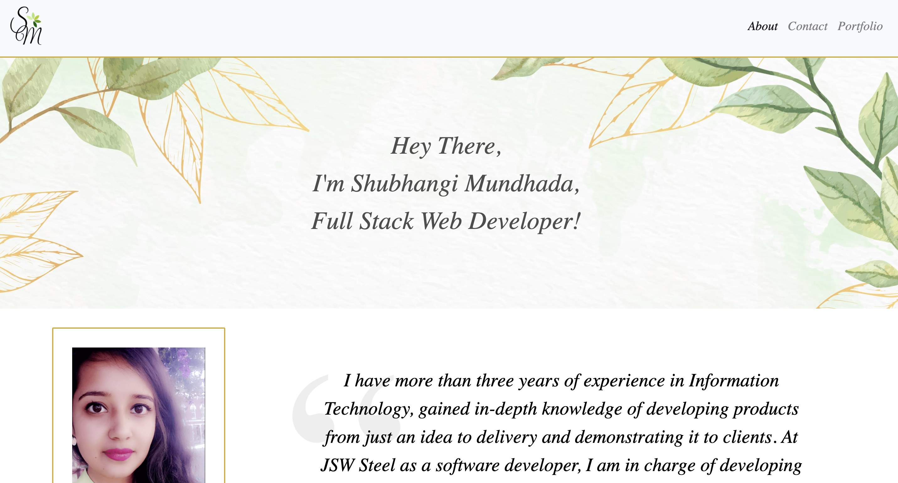

# shubhangi_portfolio
---

## Table of Contents
---
* [Description](#Description)
* [Installation](#Installation)
* [Usage](#Usage)
* [Contributors](#Contributors)
* [Test](#Test)
* [License](#License)
* [Questions](#Questions)
* [Demo](#Demo)

## Description 
---
This program is a portfolio of my work so far. There are multiple projects that I have worked by myself or in groups. It also consist a little bit about me and contact information. It also has the links to my facebook, instagram, github and linkedIn. This portfolio can be seen in any devices because the program is responsive.

## Installation 
---
No Installation Required 

## Usage 
---
Viewing Purpose Only

## Contributors
---
Shubhangi Mundhada

## Test
---
Jest

## License
---
MIT

## Questions
---
Github Link - https://github.com/smundhada
Email - shubhimundhada@gmail.com

# Demo 
---
## [demo-link](https://smundhada.github.io/shubhangi_portfolio/)

